  

  
  
  
  

  
  
  
  
  
  

---

## ⚡ À propos de moi

Je suis **Responsable SIG** à la *Communauté de communes des Sablons*, diplômé en **Mastère Urbanisme & Aménagement (ENAU)** et certifié **FME Form Advanced**.

Je suis le créateur de l'extension officielle QGIS **[GeoBan France](https://plugins.qgis.org/plugins/geoban_france/)**, conçue pour simplifier le géocodage d'adresses et la recherche cadastrale pour les géomaticiens et aménageurs du territoire.

> 🎯 **Posture de travail** : De la donnée spatiale brute à l'outil cartographique décisionnel et opérationnel prêt à l'emploi.

---

## 📦 Focus Projet : Extension Officielle QGIS `GeoBan France`

**GeoBan France** est une extension QGIS publiée sur le **dépôt officiel des extensions QGIS**. Elle regroupe dans une interface unifiée le géocodage d'adresses et la recherche cadastrale en France.

### 🌟 Fonctionnalités clés :
- 📍 **Recherche d'adresses instantanée** : Connexion directe à l'API **Base Adresse Nationale (BAN)** avec autocomplétion et filtres par code postal / commune.
- 📐 **Recherche cadastrale IGN APICarto** : Extraction des parcelles avec calcul automatique de la surface, du périmètre et des coordonnées (Lambert 93, CC49, WGS84).
- 🎯 **Outil "Identifier" interactif** : Clic dynamique sur la carte QGIS pour afficher simultanément l'adresse la plus proche, la parcelle cadastrale sous le curseur et les coordonnées projetées.
- 🖨️ **Mise en page A4 Automatisée** : Génération en un clic d'un atlas prêt à l'export (PDF/Image) avec échelle, cartouche et flèche Nord.
- ⭕ **Buffers & Exports multi-formats** : Calcul de zones tampons de voisinage, signets spatiaux et exports instantanés vers CSV, GeoJSON et KML.

#### 💡 Comment l'installer dans QGIS ?
> Ouvrez **QGIS** ➔ **Extensions** ➔ **Installer/Gérer les extensions** ➔ Cherchez `GeoBan France` ➔ Cliquez sur **Installer**.

---

## 🛠️ Stack Technique & Domaines d'Intervention

### 🗄️ Spatial Data & Databases
- **PostgreSQL / PostGIS** : Modélisation conceptuelle, requêtage spatial complexe, vues et couches virtuelles, optimisation SQL.
- **Dépôts de données nationaux** : Intégration de la Base Adresse Nationale (BAN), APICarto (IGN), COG CARTO.

### ⚙️ SIG & Outillage Automatisé
- **QGIS & PyQGIS** : Développement de plugins Python natifs, scripts de traitement automatisés, Composer & mises en page d'atlas.
- **FME Form Advanced** : Certification Safe Software / Avineon Tensing pour les workflows complexes de transformation et d'intégration de données.
- **Python & Bash** : Automatisation de pipelines d'ingestion et de nettoyage géospatial.

### 🤖 GeoAI & Innovation Cartographique
- **GeoAI & LLM** : Utilisation d'outils d'IA (Claude, GeoSQL, Segment Anything, PyQGIS AI) pour accélérer le développement SQL et l'analyse d'imagerie.
- **WebMapping** : Publication et déploiement de projets cartographiques interactifs (Lizmap Docker stack).

---

## 🎓 Formation & Certifications

- 📜 **Certification FME Form Advanced** — *Avineon Tensing France / Safe Software* (2025)
- 🎓 **Mastère en Urbanisme & Aménagement** — *École Nationale d'Architecture et d'Urbanisme (ENAU)*
- 🏆 **1er Prix Concours d'Urbanisme** — *Concours "Face à l'horloge" (2019)*

---

## 🚀 Projets Open Source sur GitHub

| Projet | Description | Liens & Dépôt |
|---|---|---|
| 📦 **GeoBan France** | Extension officielle QGIS pour la recherche d'adresses BAN & parcelles cadastrales IGN APICarto. | 🔗 [Official QGIS Plugin](https://plugins.qgis.org/plugins/geoban_france/) · 💻 [Repo GitHub](https://github.com/mwjouini/GeoBan-France) |
| 🛠️ **qgis-geoban-finder** | Plugin et scripts d'intégration pour la recherche spatiale cadastrale et administrative. | 💻 [Repo GitHub](https://github.com/mwjouini/qgis-geoban-finder) |

---

## 📊 Statistiques GitHub

  
  

---

## 📫 Me Contacter & Réseaux

- 💼 **LinkedIn** : [Mohamed Wael JOUINI](https://www.linkedin.com/in/jouinimohamedwael)
- 🔌 **Profil Auteur QGIS** : [JOUINI Mohamed Wael sur QGIS Plugins](https://plugins.qgis.org/plugins/author/JOUINI%2520Mohamed%2520Wael/)
- 💻 **GitHub** : [@mwjouini](https://github.com/mwjouini)
- ✉️ **Email** : [mohamed.wael.jouini@gmail.com](mailto:mohamed.wael.jouini@gmail.com)
- 📍 **Localisation** : Bois-Colombes, Île-de-France, France
